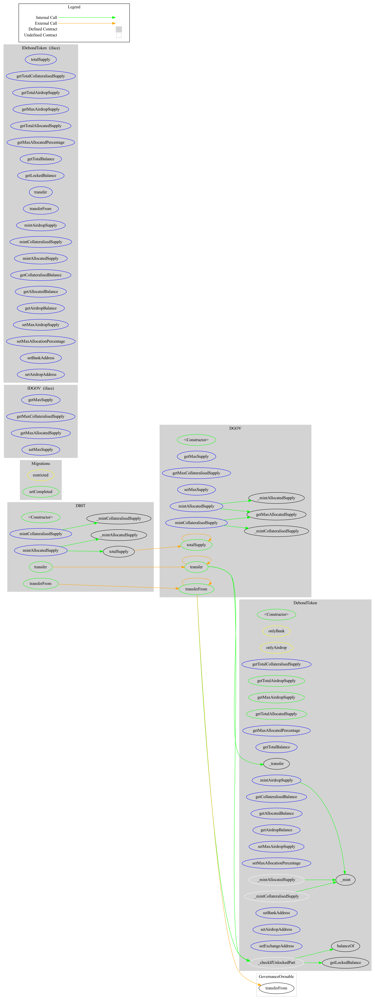

## Debond-ERC3475: 

This package consist of extended implementation of ERC3475 standard interface  for Debond Protocol. all writable  external functions are callable by either  BankBondManager or Exchange  contract for the  issuance and  redemption of the bonds ans associated conditions.

## Structures: 
```solidity
   // Nonce for  storing issuance  details about the bonds, supplies and other 

  struct Nonce {
        uint256 id;
        bool exists;
        uint256 _activeSupply;
        uint256 _burnedSupply;
        uint256 _redeemedSupply;
        uint256 classLiquidity; // for calculating the redemption time for  floating rate.
        mapping(uint256 => IERC3475.Values) values;
        mapping(address => uint256) balances;
        mapping(address => mapping(address => uint256)) allowances;
    }

    /**
    * @notice this Struct is representing the Class properties as an object
    *         and can be retrieve by the classId
    */
    struct Class {
        uint256 id;
        bool exists;
        mapping(uint256 => IERC3475.Values) values;
        mapping(uint256 => IERC3475.Metadata) nonceMetadatas;
        uint256 liquidity;
        uint256[] nonceIds;
        mapping(uint256 => Nonce) nonces; // from nonceId given
        uint256 lastNonceIdCreated;
        uint256 lastNonceIdCreatedTimestamp;
    }

    mapping(uint256 => Class) internal classes; // from classId given
    mapping(uint256 => IERC3475.Metadata) classMetadatas; // stores metadata for frontend to interpret the info.
    mapping(address => mapping(address => bool)) operatorApprovals; // approval of given bond by Owner => operator =>status.
```

## Workflow: 

1. User chooses the type of bond (buying, staking) to be issued and associated parameters (as defined in Nonce) and frontend calls  then [buy/stake](https://github.com/Debond-Protocol/Debond-Bank/blob/main/contracts/Bank.sol#L166-L622) functions (which internally call issueing/Staking functions from BankBondManager from the approved classes) with the initial supply and class/ nonce parameters .

2. afterwards during the timeperiod < maturity period, owners can:
    1. Transfer their bonds (singular / batches) to  other parties.
    2. Delegate other addresses your bonds   using `setApprovalFor(for all bond classes  by the operator address )`and  `approve (approving only specific classes by the spender addresss)`.
    3. burning bonds.
    4. determine the supplied of different classes  


3. After the completion of the maturity time, users can then redeem the bond and recover their underlying tokens 


4. Also functions concerning the management of the `Metadata` (Both class and nonce) is done by the bank, but invoked only via the governance contract. 


## Setup: 

1. deployment: 
```bash

##1. Create an .env file with GOVERNANCE keysetup
##2. Then running the following command: 
> npm run deploy 

##3. Then setting up the bank and exchange address.

```

2. for inheriting the debondBond interface: install the debond-erc3475-contract using npm.


## Security Considerations/ Dependencies:
1.The security dependency is via the bank for most of the state changing functions along with checks , so insure that the  applications should  set the address of the bank correctly once deployed and also have thorough analysis of the bank contract.

2.For bonds progress, getProgress() needs access to the calculation from bankBondManager, so insure that bondManager functions should be updated in a way so that it doesn't effect the present parameters.


## Diagrams: 
 
### 1. Inheritance diagram 




### 2. dependence diagram: 

 
